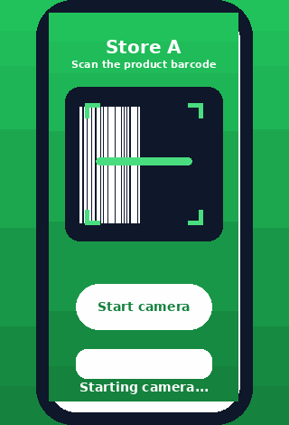
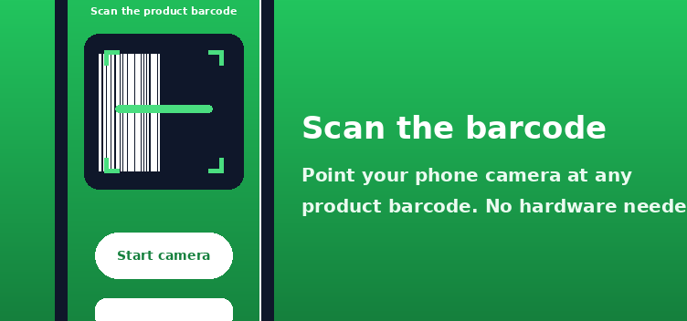
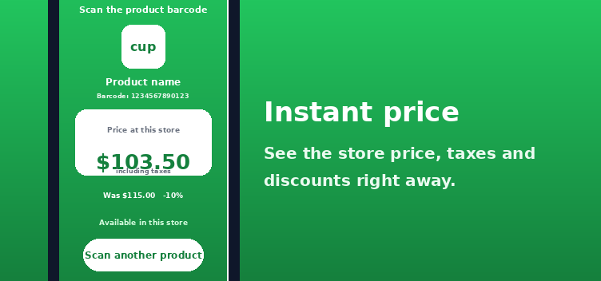
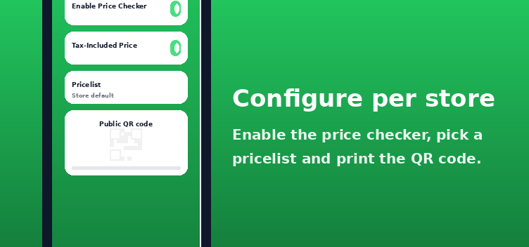

# POS Price Checker

Give every physical store a public, mobile-friendly web page where customers scan a
product barcode with their phone camera and see the price applied at **that store**
(pricelist, taxes and discounts included).

## Features

- One public page per `pos.config` store: `/price-check/<slug>`.
- Camera barcode scanning from the phone (BarcodeDetector API with ZXing fallback,
  via the Odoo `web` core `BarcodeVideoScanner`), plus manual barcode entry.
- Store-specific price computation consistent with the Point of Sale behavior.
  The price source follows this priority: the price list configured on the
  *Price Checker* tab, then the store's default price list, then the product's
  standard price.
- Tax-included or tax-excluded display, configurable per store.
- Pricelist discount and price reduction shown when applicable.
- QR code of the public page generated on the store form, ready to print and hang in
  the shop.
- JSON-RPC lookup endpoint (`/price-check/lookup`) for the frontend.
- EAN-13 / UPC-A cross-matching so both the 12- and 13-digit forms find the product.

## Demo



| Scan a barcode | Instant price | Per-store configuration |
| --- | --- | --- |
|  |  |  |

## Installation

- Add this module directory to your `addons_path`.
- Install the module `pos_kisok_price_checker`. It requires `point_of_sale`, `barcodes`,
  `website` and `base`.
- The QR codes need the Python `qrcode` library (a standard Odoo dependency,
  `pip install qrcode`). If it is missing, the QR field stays empty but the page
  still works.

## Configuration

1. Go to *Point of Sale → Configuration → Point of Sale*, open a store.
2. In the **Price Checker** tab, enable *Enable Price Checker*.
3. Optionally adjust *Tax-Included Price*.
4. Optionally pick a *Pricelist* specific to the price-checker page. When empty,
   the store's default price list is used, or the product's standard price if
   the store has none. Priority: kiosk pricelist → store default pricelist →
   standard price.
5. Leave *URL Slug* empty to auto-generate it from the store name (e.g. `Store A`
   becomes `/price-check/store-a`). A slug is `[a-z0-9-]`, between 1 and 50
   characters, and must be unique.
6. Save the store. The **Public URL** and the **QR Code** are generated on the
   same tab. Print the QR code and place it on the shelves or at the checkout
   counter so customers can open the page with their phone camera.
7. Optionally add the *Price Checker* page to your website navigation or link it
   from your online shop for extra visibility.

## Notes

- The public page and the lookup endpoint are public (no login required) and read-only
  (`auth='public'`, `readonly=True`). Only the store slug, barcode and the store price
  of the requested product are exposed.
- The QR code is generated with the `qrcode` Python library (a standard Odoo
  dependency). If it is not installed, the field stays empty and the page still
  works.

## Tests

Run the test suite (requires the module to be installed):

```
odoo --addons-path=addons,enterprise-18.0,custom --database=odoo18 \
     -i pos_kisok_price_checker --stop-after-init --test-enable
```

Tests cover slug auto-generation and constraints, per-store price computation
(pricelist discounts, taxes, tax-included flag), EAN/UPC cross-matching and the HTTP
routes (`/price-check/<slug>` and `/price-check/lookup`).

## Publishing to the Odoo Apps Store

The module ships with the assets expected by Odoo Apps:

- `static/description/icon.png` — module icon (128×128), also shown in *Apps →
  Update Apps List*.
- `static/description/index.html` — the description / indexing page shown in the
  Odoo backend and used for the Apps listing (features, demo GIF, screenshots and
  configuration steps).
- `static/description/banner.png` — cover banner (960×300), used for the Apps
  cover image.
- `static/description/screenshots/` — usage screenshots (752×352).
- `static/description/demo.gif` — animated demo of the scanning flow.

Before submitting:

1. Replace the placeholders in `__manifest__.py`: `author` and `website` (your
   GitHub/site), and review the `description`.
2. Verify the module installs cleanly (`-u pos_kisok_price_checker`) and the tests pass.
3. Create the module zip (see
   https://odoo.com/page/odoo-apps-requirements for packaging guidelines).
4. Submit it at https://apps.odoo.com and set it as a *free* module.
